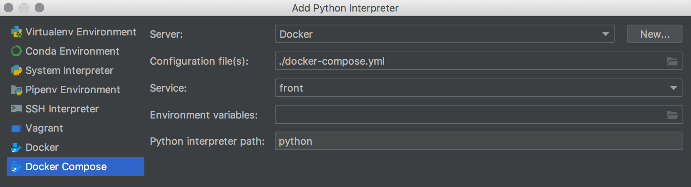
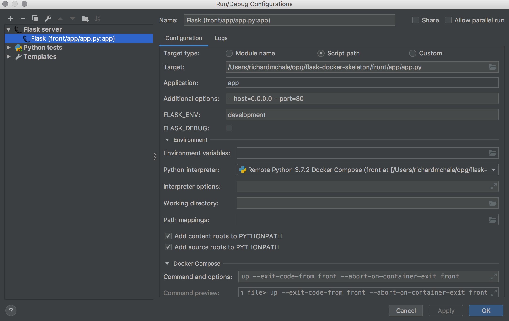
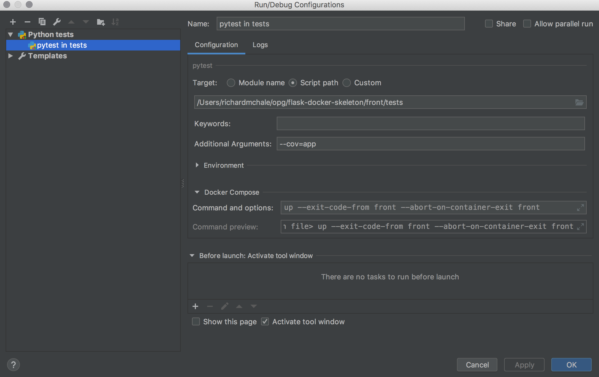

# flask-docker-skeleton

A simple app to test using Python Flask in an Alpine-Python image, for local development and deployment through a CI pipeline

It has two routes '/' for a straight text response and '/test' for an html response

## Setting up with PyCharm (Commercial)

### Set up the interpreter

* Clone the repository
* Start PyCharm and "Open..." the flask-docker-skeleton directory
* Go to Preferences > Project interpreter
* Click the cog icon next to the Project interpreter and select 'Add...'
* In the dialogue select 'Docker Compose' and accept the default values

* Under Project interpreter, select Path mappings and map /front/app to /app

* Click Ok and close the Project interpreter dialog

### Set up the app runner

* Make sure front/app is set as a Sources root
* Add a new Run/Debug configuration
* Select the Flask template
* Set the Script path > Target to the 'front/app/app.py' file
* Set Application to 'app'
* Set Additional options to --host=0.0.0.0 --port=80

* Click 'Ok'

### Set up the test runner

* Make sure front/app is set as a Sources root
* Add a new Run/Debug configuration
* Select the tests > pytest template
* Set the 'Script path' to the 'front/tests' directory
* Set the 'Additional Arguments' to --cov=app

* Click 'Ok'

## Troubleshooting

### Docker/Docker Compose unavailable as a Project Interpreter

You may need to enable Remote Interpreter. There is also a bug with PyCharm where the docker options can disappear from the list and the solution that worked for me was to delete my PyCharm settings folder and restart PyCharm

### pycharm couldn't find `docker` binary.

Current [bug](https://youtrack.jetbrains.com/issue/PY-29342) within pycharm where it might not detect that Docker is installed. Simple fix below.

1. Run Tools | Create Command-line Launcher from the PyCharm menu.
2. Run /usr/local/bin/charm from terminal.
